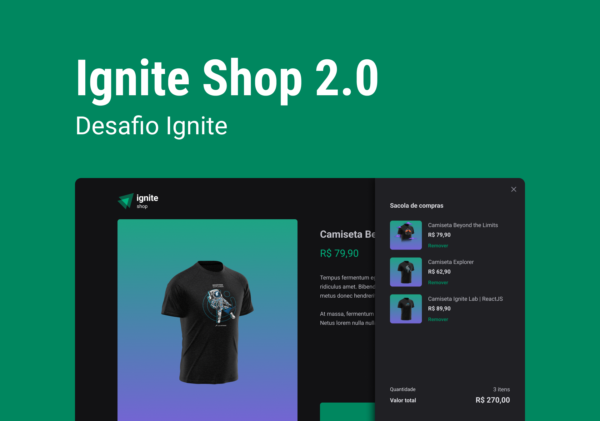

<div align="center">
  
</div>

<h1 align="center" style="display: flex; align-items: center; justify-content: center; gap: 1rem;">Ignite Shop - Ignite</h1>

<h4 align="center">
  Desafio do Ignite feito no quarto módulo da trilha de ReactJS.
</h4>

<p align="center">
  <a href="#-tecnologias">Tecnologias</a>&nbsp;&nbsp;&nbsp;|&nbsp;&nbsp;&nbsp;
  <a href="#-como-executar">Como executar</a>&nbsp;&nbsp;&nbsp;
</p>


## 👨‍💻 Projeto

Foi usado no projeto Next + Typescript onde foi desenvolvido um mini e-commerce para vender camisetas customizadas da Rocketseat. Utilizamos a aplicação desenvolvida na trilha para implementar um carrinho que utilizará os dados da API do Stripe para buscar os itens existentes, e controlará, através da aplicação, os itens que a usuário deseja comprar.

O projeto foi desenvolvido usando um layout fornecido pela Rocketseat, para que fosse possível seguir e implementar as funcionalidades e o design desenhadas no Figma.

## 🧪 Tecnologias
Foram usadas as seguintes tecnologias:

  - Next 13
  - Typescript
  - Eslint
  - Prettier
  - Commitlint
  - Husky
  - Lint-Staged
  - Phosphor Icons
  - Context API
  - Next Routing
  - Stitches

## 🧑‍🔧 Funcionalidades
Algumas das funcionalidades propostas no desafio
  - Adicionar um ou mais itens no carrinho;
  - Salvar todos os itens selecionados no carrinho, e exibir o número de itens no carrinho;
  - Utilizar os itens do carrinho para gerar um checkout usando stripe;

## 🚀 Como executar

Faça um clone do projeto e acesse a pasta criada.

```
  $ git clone https://github.com/fabriciolak/ignite-shop.git
  $ cd ignite-shop
```
Para iniciá-lo, siga os passos abaixo:

## 👾 Instalar as dependências
Aliases: ``` install ```
```
  $ yarn
```

## 😎 Iniciar o projeto
```
  $ yarn dev
```
A aplicação estará disponível no endereço http://localhost:3000.

## 🎨 Layout
Acesse o layout do desafio

Criado com Figma.

<a href="https://www.figma.com/file/kJX0eJI4OLxasc9ALO2LvQ/Ignite-Shop-2.0-(Copy)" target="_blank">Ignite Shop</a>


<h1 align="center">
  <a href="https://www.github.com/fabriciolak">
    
  </a>
</h1>
